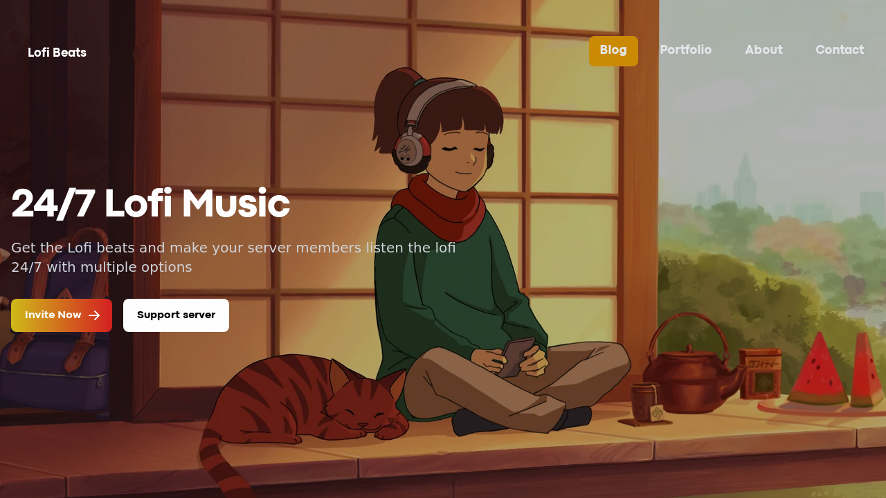

# Discord Bot website using Next.js + Tailwind CSS Starter

A starter template for building web applications with Next.js, Tailwind CSS, and TypeScript. This template includes a preconfigured development environment, as well as a basic set of components and layout styles to get you started.



## Features

- Next.js 13 (with SSR, automatic code splitting, and optimized performance)
- Tailwind CSS 3.2.4 (with support for custom configuration and purging)
- TypeScript 4.8.2 (with type checking and linting configured)

To use this template, you will need to have the following tools installed on your system:

- [Node.js](https://nodejs.org/en/): Node.js is a JavaScript runtime that is used to run the development server and build the application. This template requires Node.js version 14 or higher.

- [Yarn](https://yarnpkg.com/): Yarn is a package manager for Node.js packages. This template uses Yarn to manage dependencies and run scripts.

## Installation

1. Clone this repository:

```bash
git clone https://github.com/DevRohit06/Discord-bot-website.git
```

2. Navigate to the project directory:
```bash
cd Discord-bot-website
```

3. Install dependencies:
```bash
npm install
```
4. Start the development server:
```bash
npm run dev
```

This will start the development server and open a new browser window with the application running. As you make changes to the code, the application will automatically reload to reflect those changes.

## License
This template is licensed under the MIT License. 
See the [LICENSE](LICENSE) file for details.
"# Discord-bot-website" 
"# Discord-bot-website" 
